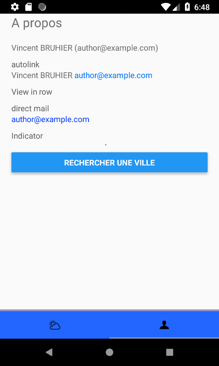

Application Mobile : Simple Meteo
========================================

Application React Native tutorial (android application)

## References

* excellent vidéo YouTube [Découverte de ReactNative, App Météo](https://www.youtube.com/watch?v=Y7rbJRjaYCY) de [Grafikart.fr](https://www.grafikart.fr/)

## Documentations

Pré-requis système
* support pour Android : [docs/requirement-android.md](docs/requirement-android.md)
* support pour iOS : TODO

React-native
* commencer avec React Native : [docs/started-reactnative.md](docs/started-reactnative.md)

## Projet

### aperçu

| search pane                              | forecast pane                                | about pane                              |
|:----------------------------------------:|:--------------------------------------------:|:---------------------------------------:|
|    |    |     |

### demarrage

Configurer l'accès au service au service météorologique d'[OpenWeatherMap](https://openweathermap.org)
* créer une clé d'accès à l'API Rest en s'enregistrant avec une adresse mail à partir du site [openweathermap.org](https://openweathermap.org/api)
* créer un fichier '.env' à partir du fichier d'exemple fourni [env-example](env-example) avec votre clé OpenWeatherMap

Démarrer votre application
~~~shell
[user@computer ~]$ cd <<project-dir>>
[user@computer project]$ [ ! -f ./local.properties ] && echo "sdk.dir=${ANDROID_SDK_ROOT}" > ./local.properties
[user@computer project]$ npm install
[user@computer project]$ react-native <run-ios|run-android>
~~~

### complements

[docs/project.md](docs/project.md)
