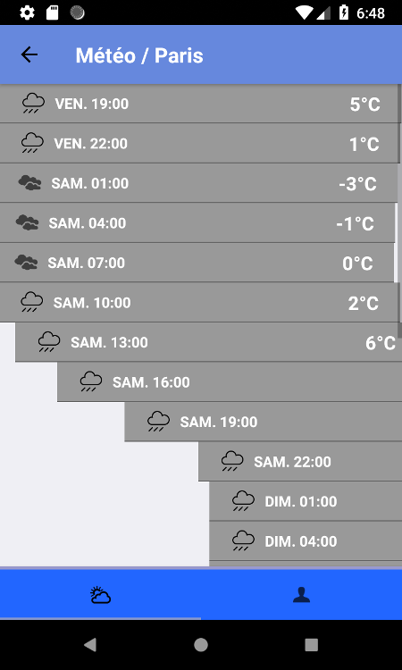

Application Mobile : Simple Meteo
========================================

Application React Native tutorial (android application)

## Références

Référence :
* vidéo youtube (https://www.youtube.com/watch?v=Y7rbJRjaYCY)
* keyworks : Tuto + ReactNative + App + Météo

## Pré-requis système

Documentations
* Android : [docs/requirement-android.md](docs/requirement-android.md)
* iOS : TODO
* React Native : [docs/requirement-reactnative.md](docs/requirement-reactnative.md)

## Todo list

* internationnalization
* logging
* test unit

## project

### screenshots

| search pane                              | forecast pane                                | about pane                              |
|:----------------------------------------:|:--------------------------------------------:|:---------------------------------------:|
|    |    |     |

### local properties

Indiquer le path ANDROID_SDK_ROOT via le ./local.properties
~~~text
# ====================================================================================================================================
# SDK location not found. Define location with sdk.dir in the local.properties file or with an ANDROID_HOME environment variable
# ====================================================================================================================================
sdk.dir=/home/vbruhier/Android/Sdk
~~~

### dependances

Project extra-dependencies in the react-native project

| dependency                | description                                                      |
|-------------------------- |----------------------------------------------------------------- |
| react-native-autolink     | text with link (ex : mailto, url, hashtag)                       |
| react-navigation          | navigation context in your application (example : 'go back')     |
| axios                     | HTTP call library appel (use for API Rest)                       |
| moment                    | date library                                                     |
| dotenv                    | extension library for your custom var ('.env' file)              |
| react-native-dotenv       | extension library for your custom var ('.env' file)              |

Install or reload dependancies via npm (package.json)
~~~shell
[user@computer ~]$ cd <<project-dir>>
[user@computer project]$ npm install
~~~

### variables projets

Créer un fichier .env à partir du fichier d'exemple fourni [env-example](env-example)

### forecast webservice

This project use webservice [openweathermap.org](https://openweathermap.org).

* [openweathermap.org](https://openweathermap.org) API Rest documentation : [https://openweathermap.org/api](https://openweathermap.org/api)

Call webservice sample with curl
~~~
[user@computer ~]$ curl "http://api.openweathermap.org/data/2.5/forecast?q=Paris&APPID=xxxxxx"
...
[user@computer ~]$ 
~~~

To get a API KEY for [openweathermap.org](https://openweathermap.org), you need to sign up with an email address on [openweathermap.org](https://openweathermap.org).

